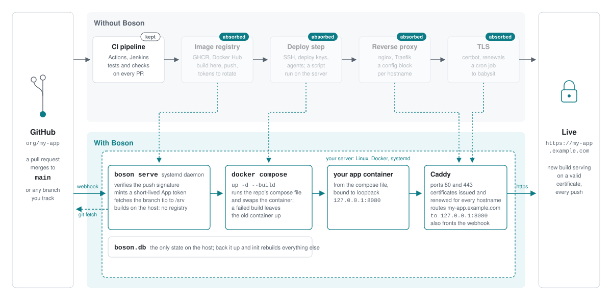

# boson

Push-to-deploy for a single Linux server.

Boson runs on your production host and automatically clones your GitHub repos and runs each one with `docker compose up -d --build`, routes a public hostname to each with automatic TLS using Caddy, and redeploys on every push.

Per project it takes one input: the repo. What it serves is in the repo's own `_boson.yml`.



Boson is for the small-server deployment shape where you want a GitHub push to update a private Docker Compose app, but you do not want GitHub Actions to SSH into production, do not want to maintain GitHub-hosted runner IP allowlists, do not want to run a registry, and do not want a self-hosted CI runner sitting on the box.

Boson keeps the deploy path server-side and webhook-driven:

```text
GitHub push webhook -> boson -> git fetch/reset -> docker compose up -d --build
```

1. **Point DNS at your server** for boson's admin hostname and each deployment hostname.
2. **Run `boson init <hostname>` to install boson on your server**, which receives GitHub webhooks and routes traffic to your deployed Docker containers.
3. **Run `boson add <org/name>` to connect your server to GitHub and fetch your private repo.**
4. **Set up your project secrets** in `/var/lib/boson/env/<org>/<name>/...` for each container runtime environment.
5. **Use `boson deploy <org/name>` to build and run** your project's containers.

General challenges boson is avoiding:

| Alternative | Cons |
|---|---|
| GitHub Actions +<br>SSH | ❌ Requires SSH from GitHub-hosted runners into production<br>❌ Hosted-runner IP allowlists are broad, change often, and are not recommended<br>❌ Puts deploy credentials in GitHub Actions secrets<br>❌ Deploy behavior lives in an ad hoc SSH script on the server |
| GitHub Actions +<br>private registry | ❌ Requires registry credentials in CI<br>❌ Requires pull credentials on the server for private images<br>❌ You must define tag naming, cleanup policy and rollback-by-tag rules<br>❌ Server still needs a webhook, runner, poller or SSH step to pull and restart |
| GitHub Actions +<br>message bus +<br>Watchtower | ❌ Requires a private registry and pull credentials<br>❌ Requires operating a queue or bus just to deliver deploy events<br>❌ Adds a long-running subscriber or polling process on the server<br>❌ Splits deploy behavior across CI, queue, subscriber, Watchtower and Docker |
| Self-hosted Actions runner | ❌ Runs a CI executor on or near production<br>❌ Self-hosted runners are not guaranteed to be clean between jobs<br>❌ Any workflow that can reach the runner can affect production<br>❌ Adds runner patching, isolation and lifecycle work |
| Dokku | ❌ Introduces a PaaS app model rather than plain Compose<br>❌ App layout and deploy behavior need to fit Dokku conventions<br>❌ Adds Dokku app, plugin and release concepts for a single Compose app |
| CapRover | ❌ Adds dashboard-managed platform state<br>❌ Deploy state is managed through CapRover's app model, not just git checkout + compose<br>❌ Adds dashboard, app definitions and platform services to operate |
| Coolify | ❌ Runs a larger app platform stack to solve a single webhook-and-compose deploy problem<br>❌ Adds database, worker, proxy and platform services to debug<br>❌ More platform state to debug when deploys fail |
| Kamal | ❌ Uses SSH orchestration to reach hosts<br>❌ Registry login and image distribution are part of the normal path<br>❌ Requires separate Kamal config for servers, registry, builder/proxy and accessories |
| Hand-rolled webhook | ❌ You own HMAC verification<br>❌ You own deploy locking and idempotency<br>❌ You own logs, retries, TLS, reverse proxy config and failure handling |

## Install

```bash
curl -fL https://github.com/pingfu/boson/releases/latest/download/boson-linux-x64 -o /tmp/boson
install -m 755 /tmp/boson /usr/local/bin/boson

boson init deploy.example.com        # boson's own hostname
```

`deploy.example.com` is boson's own hostname, resolving to this server. You use it to check the platform and to add projects. GitHub never connects to it, so a private name works too (`boson.enclave`), at the cost of a browser warning: Caddy issues that one itself, since a public CA won't.

Every project you add brings a second kind of hostname, its own public one, and that is where GitHub delivers its webhooks. Those need public A records pointing at this server, with ports 80 and 443 free on the host and reachable from the internet.

`init` verifies the software requirements (Docker with the compose v2 plugin, `git`, systemd, root), then installs the platform. TLS certificates are provisioned and renewed automatically, here and for each project hostname you add, and plain HTTP redirects to HTTPS. Confirm the install by opening `https://deploy.example.com/_boson/health`: a 200 proves DNS, reachability and TLS end to end.

## Prepare your project

Your repo needs two files at its root. A `_boson.yml` saying what to deploy where:

```yaml
version: 1

deployments:
  - branch: main
    hostname: example.org
    env: production
```

and a `docker-compose.yml` whose web-facing service publishes to loopback on `${BOSON_PORT}`:

```yaml
services:
  web:
    build: .
    image: my-app:${BOSON_COMMIT}                  # so old builds stay deployable
    ports:
      - "127.0.0.1:${BOSON_PORT}:8080"             # boson's port : your app's port
    env_file: ${BOSON_ENV_FILE}                    # if your app takes env vars
    volumes:
      - /var/lib/my-app/${BOSON_BRANCH_SLUG}:/data # if your app keeps state
```

That pair is the whole contract. One repo can serve several hostnames and deploy more than one branch, each to its own hostname with its own containers: [BOSON_YML.md](BOSON_YML.md) covers the format.

`env: production` names a file on the server: `env: <name>` maps to `/var/lib/boson/env/<org>/<name>/<name-of-set>`, so `production` means `/var/lib/boson/env/org/my-app/production`. You create it after `boson add` and before the first deploy, and boson passes its path to compose as `$BOSON_ENV_FILE`. Nothing is written into the checkout, so `git reset --hard` on each deploy cannot touch it, and a `--purge` cannot take it. Commit a template (`.env.example`) so the shape is in the repo and the values aren't. Different branches can name different sets, which is what keeps a preview branch off the production credentials.

boson allocates a published port per branch and sets `BOSON_PORT` for every `docker compose` it runs. Your repo names only the port your app listens on inside the container, `8080` here, so the same repo deploys to any boson server without carrying a number that's true on one machine. A deploy whose compose file publishes some other port fails before it builds, and says which one boson expected.

`BOSON_COMMIT` is the commit that deploy fetched. Tagging the image with it gives each build a name of its own instead of overwriting `latest`, which is what lets `images.keep` retain the last few and delete the rest. An app that reports its own version wants the same value.

`BOSON_BRANCH_SLUG` is the branch name reduced to something safe for a hostname, a directory and a compose project, and stable for the deployment's life. Every host path your compose mounts needs it in the path. A fixed path gives every branch of the repo the same directory, so a staging deployment writes into production's database and any migration it runs arrives in production with it. Named volumes have the same problem and the same fix:

```yaml
volumes:
  data:
    name: my-app-${BOSON_BRANCH_SLUG}
```

The deployments stay separate either way, which also means a new branch starts with empty state rather than a copy of production's.

Four ports belong to the platform, and boson allocates from 30000-32767:

| Port | Listens on | Used by |
|---|---|---|
| 80 | every interface | Caddy, for plain HTTP |
| 443 | every interface | Caddy, for HTTPS: your sites are served here |
| 2019 | 127.0.0.1 | how boson tells Caddy which hostname goes to which container |
| 9000 | 127.0.0.1 | boson itself, which Caddy hands GitHub's push notifications and the setup pages |

Caddy proxies the public hostname to that loopback port. The whole hostname maps to your container: boson reserves one path on it, `/_boson/webhook/`, where GitHub posts.

## Add a project

```bash
boson add org/my-app
```

Nothing else to pass: the repo's `_boson.yml` names the hostnames and branches, and `add` clones the repo to read it.

`add` prints a setup URL; open it in any browser (your own machine is fine): you create a GitHub App for the project, then install it on the repo. Boson then clones the default branch into `/srv/org/my-app/<branch>/`, creates a deployment for every branch the file names outright, allocates each one a published port, and sets up routing and certificates. `boson status` shows what it made.

Ctrl-C stops the progress display, not the add: complete the browser steps and the project is added anyway (`boson status` shows it). Abandon the browser instead and nothing was saved; re-run the same command to start over.

`add` fetches the code but doesn't deploy, so you can set up secrets first. It reads the repo's `_boson.yml` and prints the environment sets it names, one path per set. Each filename is the value you wrote after `env:`, so the `env: production` above means a file called `production`, filled in from the template the repo committed:

```bash
mkdir -p /var/lib/boson/env/org/my-app
cd /var/lib/boson/env/org/my-app

cp /srv/org/my-app/main/.env.example production   # `env: production` in _boson.yml
nano production                                   # fill in the real values

chown -R boson:boson /var/lib/boson/env
chmod 600 production
```

The `chown` is load-bearing: the daemon runs as `boson` and shells out to compose as `boson`, so a root-owned `0600` file gives you a deploy failure that reads like a missing file. Repeat for every set the file names, and give a staging or preview set its own values rather than copying production's, or a branch anyone can push gets your production credentials.

Then `boson deploy org/my-app`. A project serving more than one branch needs `--branch <name>` to say which. The first successful deploy of a branch switches on push-to-deploy for it. A deploy whose set doesn't exist fails naming the path, so a missing secret is never a half-started container.

## Deploy

**Every push to a declared branch deploys automatically**: fetch, `docker compose up -d --build`, live. Pushes that land mid-deploy are remembered: the newest commit deploys when the running one finishes, and a burst of pushes costs at most one extra deploy. Two branches deploying at once don't wait for each other.

Push a branch that matches a pattern entry and boson creates its deployment on the spot: a hostname from the template, a port of its own, a certificate. It runs until its `expire_after` elapses, or until the project is removed.

`boson deploy org/my-app` deploys by hand: the first deploy after `add`, and any redeploy later. Safe to re-run. A deploy succeeds when `docker compose up` exits 0; add a compose `healthcheck` if you want a health gate.

`boson deploy org/my-app --branch feature/x` redeploys an existing deployment. Pattern branches are first created by pushes, because the push is what names the branch that matched the pattern.

Recover a bad deploy by pushing a fix, or a revert. Every deploy takes the branch tip, so the next push replaces whatever is running. A build that fails leaves the previous container in place, so a broken commit costs a failed deploy rather than an outage; a commit that builds and then misbehaves is live until the next push.

### Reading GitHub's webhook dashboard

In App → Advanced → Recent Deliveries: red means broken, green means fine.

| Status | Meaning |
|---|---|
| 202 | Push verified, deploy queued |
| 200 | Push verified, nothing to do (ping, a tag, or a branch awaiting its first deploy) |
| 403 | Signature mismatch: the stored secret and GitHub disagree. An incident. |

A 202 means the deploy was queued; its outcome lives in `boson status` and the deploy log. Recover a failed delivery with GitHub's Redeliver button, or just run `boson deploy <org/name>`.

## Commands

```
boson init <admin-hostname>   # install the platform
boson add <org/name>          # add a project (then: boson deploy)
boson deploy <org/name>       # redeploy by hand; --branch <name> picks one of several
boson status                  # platform and deployments: version, containers, last deploy
boson remove <org/name>       # tear down a project and every branch it deploys
boson uninstall               # remove the platform
```

Run every command as root: the CLI manages the platform's user, systemd unit and data directories, and the daemon's socket admits only root and the `boson` user.

Exit codes: `0` success, `1` user error, `2` runtime failure, `3` deploy already running, `99` internal bug (file an issue).

`https://deploy.example.com/_boson/health` returns the running version. When it doesn't answer, `systemctl status boson` says why.

`boson status` reports the daemon's version and the admin URL, then repo, hostname, published port, branch, webhook, container states and last deploy for every deployment, one hostname per line.

For everything else, the usual tools work: `docker logs` for container output, `journalctl -u boson` for the daemon, `/var/log/boson/deploys/` for per-deploy build output.

Re-running `boson init` rebuilds everything derived (routing, the systemd unit) from the database: the recovery move after restoring a backup or manual fiddling. Reboots take care of themselves.

## Upgrade

```bash
curl -fL https://github.com/pingfu/boson/releases/latest/download/boson-linux-x64 -o /tmp/boson
install -m 755 /tmp/boson /usr/local/bin/boson

systemctl restart boson
boson --version
```

Your sites keep serving throughout, and the restart waits for a deploy in flight to finish.

## Back up one directory

`/var/lib/boson/` holds the two things the host cannot recreate: `boson.db`, with every project's GitHub App private key and webhook secret, and `env/`, with your environment sets. GitHub issues the App keys once and cannot re-issue them; lose them and every project must be re-added by hand. A `cp` of the database taken mid-write can be corrupt, so snapshot it first, then take the lot:

```bash
sqlite3 /var/lib/boson/boson.db "VACUUM INTO '/var/lib/boson/boson.db.backup'"
tar -czf /backup/boson.tar.gz -C /var/lib/boson boson.db.backup env
```

Keep a copy off-host. Everything else is rebuildable: checkouts come back from GitHub, images from a build.

## Remove a project

```bash
boson remove <org/name>           # stop every branch's containers, drop routing, keep the record
boson remove <org/name> --purge   # also delete the record and /srv/<org>/<name>
```

Boson prints the App's settings URL so you can uninstall it on GitHub. Every hostname and port the project held is freed for reuse either way.

## Uninstall the platform

```bash
boson uninstall               # remove daemon, user, Caddy; keep all data
boson uninstall --purge       # destroy the data too (typed confirmation; offers a final DB backup)
```

The default keeps `boson.db` and all checkouts, so a later `init` brings everything back intact. Refuses to run while active projects exist (use `boson remove` first, or `--force`). The binary itself is yours to delete: `rm /usr/local/bin/boson`.
